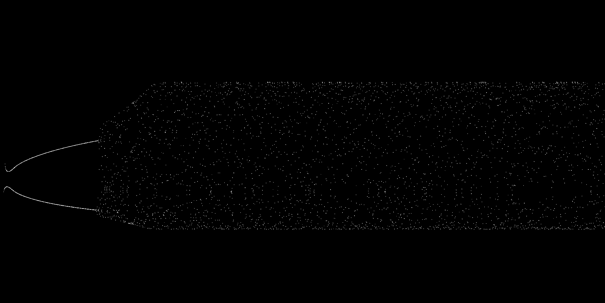
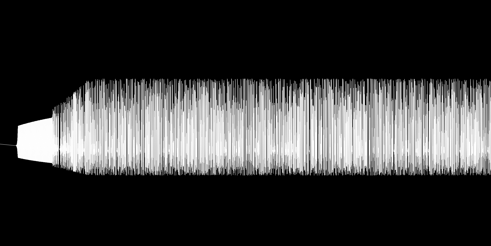

# Logistic_Map_Python



Using this Python code you can run the Logistic Map in a 3d environment. 

## Setup
Works on ```Python 3.7.8``` or later.
- Download the ```requirements.txt``` file and from the terminal type: ```pip install -r requirements.txt```; or you can type:
```python
pip install PyQtGraph
pip install PyOpenGL
pip install numpy
pip install PyQt5
```
Run to test :)

## Code Explanation
 
This simulation runs the following equation: ```x = yy*x * (c - x)```, which can be found on the ```Update``` function:
```python
#Update is called once per frame
def Update(self):
    #here starts the algorithm
    self.x = ( (self.yy*self.x) * (self.c - self.x) )
    self.y += 0.001
    self.z = ( (self.yy*self.z) * (self.c - self.z) ) #you can delete this
    if(self.yy < 3.9999999): self.yy += 0.001 # prevent from infinite numbers
    if(self.yy >= 3.999999): self.yy = 4.0    #
    #here ends the algorithm 
    print(self.x, self.z, self.yy)#, self.z)
    self.newpoint = (self.x, self.y, self.z) # create a newpoint tuple
    #add the new point to the points list
    self.points_list.append(self.newpoint) #add the tuple to the points_list
    self.points = np.array(self.points_list) #convert the points list to a numpy.array
    self.draw()
```
```yy``` slowly increases over time, but it never exceeds ```4.0```, otherwise you'll get infinite numbers.

When calling the ```Simulation``` class, you have to specify the initial value of ```x```, the initial value of lambda ```yy```, the initial value of ```c``` and how should the graph be shown, if with dots or with edges.
```python
class Simulation(object):
    def __init__(self, x, yy, z, c, how):
        self.app = QtGui.QApplication(sys.argv)
        self.window = gl.GLViewWidget() #create a window
        self.window.setGeometry(480, 270, 800, 600) #set the geometry of the window(padding x, padding y, scale x, scale y)
        self.window.setWindowTitle("Simulation")    #set the window title
        self.window.setCameraPosition(distance=30, elevation=100) #set the camera position
        self.window.show() #show the window
```
Here you can change the initial values:
```python
if __name__ == "__main__":
                    # x    yy  z  c  how
    sim = Simulation(0.5, 3.0, 0, 1, "1")
    sim.animation()
```
If self.how is equal to "1", then it'll draw some points, if it's equal to "2", it'll draw some edges:
 

Made by [Sinho Graphics](https://instagram.com/sinho_graphics)
